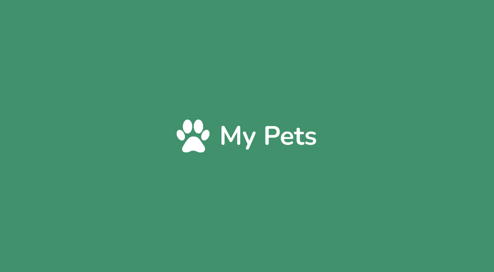

### Forms Page
Um pequeno projeto desenvolvido para fins de estudos de HTML e CSS.

### Menu

Clique para expandir

◽ <a href="#inicio">Início</a>  
◽ <a href="#pre-requisitos">Pré-requisitos</a>  
◽ <a href="#acessar-projeto">Acessar Projeto</a>  
◽ <a href="#previa">Prévia Figma</a>  
◽ <a href="#instalacao">Instalação</a>  
◽ <a href="#tecnologias">Tecnologias</a>  
◽ <a href="#topicos">Tópicos</a>  
◽ <a href="#status">Status do Projeto</a>  
◽ <a href="#autor">Autor</a>  

<h3 id="inicio">Início</h3>

Clique em [My Pets](https://github.com/MikamyHz/my-pets) para acessar.

<h3 id="pre-requisitos">Pré-requisitos</h3>
Navegador Web

<h3 id="acessar-projeto">Acessar Projeto (EM BREVE)</h3>

- <a href="#">Acessar</a> o código fonte pelo GitHub.  
- <a href="h[ttps://github.com/MikamyHz/forms-page/archive/refs/heads/main.zip](https://github.com/MikamyHz/my-pets/archive/refs/heads/main.zip)">Download</a> do código fonte no formato zip. 
- Clonar o repositório ultilizando Git Bash + o comando:

       https://github.com/MikamyHz/forms-page.git

<h3 id="previa">Préviva Figma</h3>

- <a href="https://www.figma.com/design/TODKfGCUtdlawP5d80ZBvE/my-pets?node-id=32-67&t=oROg3gV1qhrKednt-1">Prévia Figma</a> 

<h3 id="instalacao">Instalação</h3>

Não há necessidade de instalação, Clique em [My Pets](https://github.com/MikamyHz/my-pets) para acessar.

<h3 id="tecnologias">Tecnologias Utilizadas</h3>

<h3 id="topicos">Tecnologias e Ferramentas</h3>

- UX / UI Design
- HTML
- CSS
- Vs Code
- Figma

<h3 id="status">Status do projeto</h3>
Desenvolvimento.

<h3 id="autor">Autores</h3>

[Clique aqui](https://github.com/MikamyHz) e acesse meu portfólio! (em construção)  
Desenvolvido por **Mikamy Hz**

### Créditos
README Baseado no portfolio. do <a href="https://github.com/brseghese">Bruno Seghese</a>
